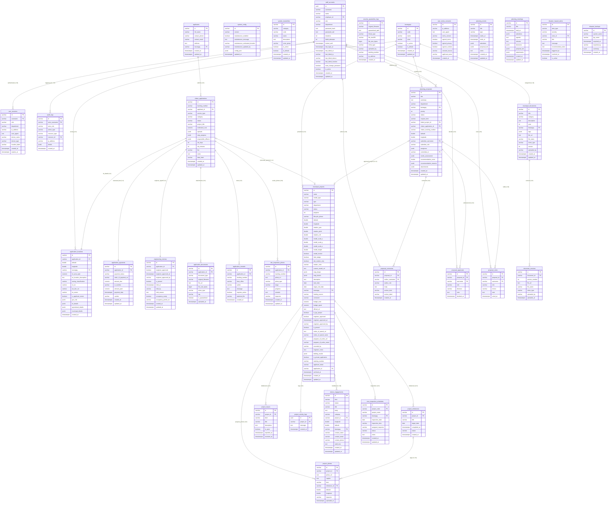

# LUISIANA INFA-TRACK — Comprehensive ERD Database Schema
This document contains the complete Entity-Relationship Diagram (ERD) with all 33 PostgreSQL tables and their attributes.

```mermaid
erDiagram
    barangays {
        varchar id PK
        varchar code
        varchar name
        varchar zone
        boolean is_active
        boolean is_default
        timestamptz created_at
        timestamptz updated_at
    }

    system_config {
        varchar id PK
        varchar version
        boolean maintenance_enabled
        text maintenance_message
        varchar maintenance_estimated_duration
        varchar maintenance_updated_by
        jsonb config_json
        timestamptz updated_at
    }

    system_masterlists {
        varchar id PK
        varchar category
        varchar code
        varchar name
        text description
        varchar zone_group
        boolean is_active
        boolean is_default
        timestamptz created_at
        timestamptz updated_at
    }

    staff_accounts {
        uuid id PK
        varchar username
        varchar name
        varchar employee_id FK
        varchar role
        varchar department
        text password_hash
        text password_salt
        int iterations
        int failed_attempts
        timestamptz locked_until
        timestamptz last_login_at
        timestamptz last_failed_at
        varchar last_failed_ip
        varchar last_failed_device
        varchar last_failed_location
        boolean must_change_password
        boolean is_active
        timestamptz created_at
        timestamptz updated_at
    }

    user_sessions {
        varchar id PK
        varchar username FK
        varchar role
        varchar department
        varchar ip_address
        text user_agent
        varchar device_name
        varchar device_type
        varchar location_label
        timestamptz created_at
        timestamptz expires_at
    }

    audit_logs {
        varchar id PK
        varchar actor_username FK
        varchar actor_role
        varchar action_type
        varchar resource_type
        varchar resource_id FK
        varchar ip_address
        jsonb details
        timestamptz created_at
    }

    security_quarantine_logs {
        varchar id PK
        varchar original_filename
        text quarantined_path
        varchar threat_type
        varchar file_sha256
        bigint file_size_bytes
        varchar mime_type
        varchar uploaded_by
        varchar tracking_number
        varchar ip_address
        timestamptz created_at
    }

    applicants {
        varchar id PK
        varchar full_name
        varchar contact_phone
        varchar contact_email
        text address
        varchar barangay FK
        timestamptz created_at
        timestamptz updated_at
    }

    user_terms_consents {
        varchar id PK
        varchar ip_address
        text user_agent
        varchar terms_version
        boolean agreed_terms
        boolean agreed_privacy
        boolean agreed_cookies
        varchar consent_source
        varchar applicant_name
        timestamptz created_at
    }

    citizen_applications {
        varchar id PK
        varchar tracking_number
        varchar applicant_id FK
        varchar service_type
        varchar category
        varchar status
        varchar project_title
        numeric estimated_cost
        jsonb uploads
        jsonb step_progress
        jsonb responsible_officers
        int sla_days
        int sla_minutes
        varchar fee
        text notes
        varchar data_hash
        timestamptz created_at
        timestamptz updated_at
    }

    application_locations {
        varchar id PK
        varchar application_id FK
        double latitude
        double longitude
        varchar barangay FK
        numeric lot_area_sqm
        text lot_location_description
        varchar zoning_classification
        varchar tct_no
        varchar tax_dec_no
        varchar lot_owner
        boolean is_applicant_owner
        jsonb geo_risk
        jsonb lot_details
        jsonb agricultural_details
        jsonb municipal_details
        timestamptz created_at
    }

    application_payments {
        varchar id PK
        varchar application_id FK
        varchar payment_status
        varchar order_of_payment_no
        numeric amount_due
        varchar or_number
        numeric amount_paid
        timestamptz payment_date
        varchar cashier
        timestamptz created_at
        timestamptz updated_at
    }

    engineering_reviews {
        varchar id PK
        varchar application_id FK
        boolean engineer_approved
        timestamptz engineer_approved_at
        varchar engineer_approved_by
        boolean is_pinned
        timestamptz held_at
        varchar held_by
        text hold_reason
        boolean occupancy_ready
        varchar occupancy_permit_no
        timestamptz created_at
        timestamptz updated_at
    }

    application_documents {
        varchar id PK
        varchar application_id FK
        varchar document_type
        varchar original_filename
        text file_url
        bigint file_size_bytes
        varchar mime_type
        varchar tag
        boolean is_quarantined
        timestamptz uploaded_at
    }

    application_remarks {
        varchar id PK
        varchar application_id FK
        varchar tracking_number
        varchar from_office
        varchar author
        text message
        boolean requires_action
        varchar attached_file
        timestamptz created_at
    }

    site_inspection_photos {
        varchar id PK
        varchar application_id FK
        varchar tracking_number
        text photo_url
        varchar photo_type
        varchar stage
        int progress
        text remarks
        varchar inspector
        timestamptz created_at
        timestamptz updated_at
    }

    municipal_projects {
        varchar id PK
        varchar name
        varchar model_type
        varchar type
        varchar department
        varchar status
        int progress
        varchar lifecycle_phase
        double latitude
        double longitude
        double rotation_yaw
        double rotation_pitch
        double rotation_roll
        double model_scale_x
        double model_scale_y
        double model_scale_z
        double model_height
        boolean model_locked
        boolean hide_badge
        boolean site_marker_only
        varchar marker_color
        text custom_model_url
        jsonb map_shape
        jsonb map_sketch
        text description
        date start_date
        date target_end_date
        varchar barangay FK
        varchar funding_source
        varchar contractor
        numeric budget_total
        numeric budget_spent
        text official_url
        boolean is_lgu_project
        boolean engineer_approved
        timestamptz engineer_approved_at
        varchar engineer_approved_by
        boolean is_pinned
        text notice_of_award_url
        varchar notice_of_award_name
        text program_of_works_url
        varchar program_of_works_name
        varchar encoded_by
        text engineer_notes
        jsonb bidding_results
        boolean is_private_application
        varchar tracking_number
        varchar applicant_name
        varchar application_id FK
        timestamptz archived_at
        timestamptz created_at
        timestamptz updated_at
    }

    project_milestones {
        varchar id PK
        varchar project_id FK
        varchar title
        date target_date
        timestamptz completed_at
        varchar status
        timestamptz created_at
    }

    project_issues {
        varchar id PK
        varchar project_id FK
        varchar kind
        varchar title
        text description
        boolean is_open
        timestamptz reported_at
        timestamptz resolved_at
    }

    project_photos {
        varchar id PK
        varchar project_id FK
        text photo_url
        text caption
        varchar kind
        varchar milestone_id FK
        double latitude
        double longitude
        varchar inspector
        timestamptz uploaded_at
    }

    project_activity_logs {
        uuid id PK
        varchar project_id FK
        text message
        timestamptz created_at
    }

    planning_proposals {
        varchar id PK
        varchar title
        text summary
        varchar department
        varchar barangay FK
        int priority
        varchar status
        varchar request_kind
        varchar linked_project_id FK
        varchar citizen_application_id FK
        varchar citizen_tracking_number
        double latitude
        double longitude
        varchar submitter_username FK
        varchar submitter_role
        jsonb assignees
        varchar committee_id FK
        jsonb needs_assessment
        double recommendation_score
        jsonb recommendation_reasons
        jsonb attachments
        timestamptz created_at
        timestamptz updated_at
    }

    proposal_comments {
        varchar id PK
        varchar proposal_id FK
        varchar author_username FK
        varchar author_role
        text body
        varchar anchor_kind
        varchar anchor_label
        timestamptz created_at
    }

    proposal_approvals {
        varchar id PK
        varchar proposal_id FK
        varchar username FK
        varchar role
        varchar decision
        text note
        timestamptz decided_at
    }

    proposal_votes {
        varchar id PK
        varchar proposal_id FK
        varchar username FK
        varchar role
        varchar choice
        text note
        timestamptz voted_at
    }

    planning_events {
        varchar id PK
        varchar title
        varchar type
        timestamptz starts_at
        timestamptz ends_at
        jsonb attendees
        jsonb proposal_ids
        text notes
        timestamptz created_at
        timestamptz updated_at
    }

    planning_meetings {
        varchar id PK
        varchar title
        timestamptz held_at
        jsonb attendees
        text agenda
        text minutes
        jsonb decisions
        jsonb proposal_ids
        jsonb attachments
        timestamptz created_at
        timestamptz updated_at
    }

    municipal_documents {
        varchar id PK
        varchar title
        varchar category
        text description
        int year
        varchar barangay FK
        jsonb tags
        text file_url
        varchar file_name
        varchar mime_type
        int version
        varchar uploaded_by
        timestamptz created_at
        timestamptz updated_at
    }

    document_versions {
        varchar id PK
        varchar document_id FK
        int version_number
        text file_url
        varchar file_name
        varchar mime_type
        varchar uploaded_by
        timestamptz uploaded_at
    }

    citizen_engagements {
        varchar id PK
        varchar kind
        varchar status
        varchar title
        text body
        varchar category
        varchar project_id FK
        double longitude
        double latitude
        varchar barangay FK
        varchar contact_name
        varchar contact_email
        varchar contact_phone
        text staff_note
        timestamptz created_at
        timestamptz updated_at
    }

    disaster_hazard_alerts {
        varchar id PK
        varchar alert_type
        varchar severity
        varchar zone_id FK
        varchar title
        text message
        text recommended_action
        timestamptz triggered_at
        timestamptz resolved_at
        boolean is_active
    }

    disaster_backups {
        varchar id PK
        varchar system_name
        varchar lgu_name
        timestamptz exported_at
        varchar exported_by
        jsonb summary
        timestamptz created_at
    }

    meo_inspection_schedules {
        varchar id PK
        varchar project_code FK
        varchar project_name
        varchar barangay FK
        date inspection_date
        varchar inspection_time
        varchar assigned_inspector
        varchar status
        text notes
        timestamptz created_at
        timestamptz updated_at
    }

    %% ---------------------------------------------------------
    %% PILLAR 1: MASTERLISTS & AUTH SECURITY
    %% ---------------------------------------------------------
    barangays ||--o{ application_locations : "zoning (1:N)"
    barangays ||--o{ municipal_projects : "jurisdiction (1:N)"
    barangays ||--o{ planning_proposals : "territory (1:N)"
    barangays ||--o{ municipal_documents : "categorizes (1:N)"
    staff_accounts ||--o{ user_sessions : "authenticates (1:N)"
    staff_accounts ||--o{ audit_logs : "logged_by (0..1:N)"
    staff_accounts ||--o{ planning_proposals : "submits (1:N)"
    staff_accounts ||--o{ proposal_comments : "authors (1:N)"
    staff_accounts ||--o{ proposal_approvals : "decides (1:N)"
    staff_accounts ||--o{ proposal_votes : "votes (1:N)"

    %% ---------------------------------------------------------
    %% PILLAR 2: CITIZEN PERMITTING & 3NF APPLICATION LIFECYCLE
    %% ---------------------------------------------------------
    applicants ||--o{ citizen_applications : "submits (1:N)"
    citizen_applications ||--|| application_locations : "lot_details (1:1)"
    citizen_applications ||--|| application_payments : "assessed_fees (1:1)"
    citizen_applications ||--|| engineering_reviews : "engineer_signoff (1:1)"
    citizen_applications ||--o{ application_documents : "attachments (1:N)"
    citizen_applications ||--o{ application_remarks : "notes (1:N)"
    citizen_applications ||--o{ site_inspection_photos : "ocular_photos (1:N)"
    citizen_applications |o--o| municipal_projects : "promoted_permit (0..1:1)"

    %% ---------------------------------------------------------
    %% PILLAR 3: MUNICIPAL INFRASTRUCTURE & 3D WEBGL
    %% ---------------------------------------------------------
    municipal_projects ||--o{ project_milestones : "milestones (1:N)"
    municipal_projects ||--o{ project_issues : "bottlenecks (1:N)"
    municipal_projects ||--o{ project_photos : "progress_photos (1:N)"
    municipal_projects ||--o{ project_activity_logs : "logs (1:N)"
    municipal_projects ||--o{ meo_inspection_schedules : "inspections (1:N)"
    project_milestones |o--o{ project_photos : "tags (0..1:N)"

    %% ---------------------------------------------------------
    %% PILLAR 4: URBAN PLANNING & COLLABORATIVE GOVERNANCE
    %% ---------------------------------------------------------
    planning_proposals ||--o{ proposal_comments : "comments (1:N)"
    planning_proposals ||--o{ proposal_approvals : "endorsements (1:N)"
    planning_proposals ||--o{ proposal_votes : "tallies (1:N)"
    planning_proposals |o--o| municipal_projects : "approved_project (0..1:1)"

    %% ---------------------------------------------------------
    %% PILLAR 5: DMS, CITIZEN ENGAGEMENT & DISASTER RESILIENCE
    %% ---------------------------------------------------------
    municipal_documents ||--o{ document_versions : "versions (1:N)"
    municipal_projects |o--o{ citizen_engagements : "feedback (0..1:N)"

```
